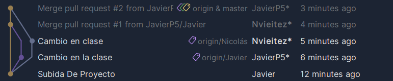

# Pasos Tarea En Equipo

## Creación del repositorio

Javier crea el repositorio mediante GitHub

## Creación de las clases

Javier y Nicolás crean cada uno su clase con su nombre

## Subida del proyecto

Javier hace un add, un commit, y un push desde el entorno gráfico y sube el proyecto a GitHub

## Creación de las ramas

Desde el entorno gráfico Javier y Nicolás crean cada uno su rama con sus nombres

## Modificación del proyecto

Nicolás hace un pull del proyecto y modifica su clase con su rama desde local
Javier ya tiene el proyecto local, puesto que lo crea el, y también modifica su clase con su respectiva rama

## Subida del proyecto modificado

Cada uno, desde el entorno gráfico, suben el proyecto a GitHub

## Merge

Cada uno crea un pull request para que sus clases se unan a las que están en la rama master

## Resultado

